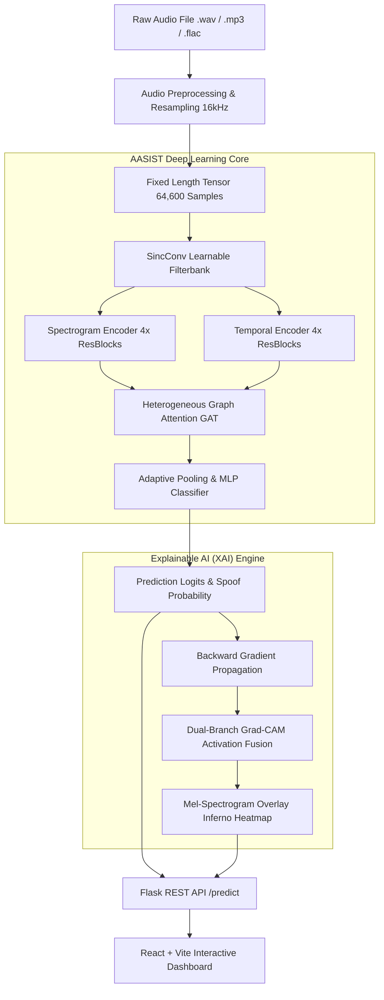

# 🎙️ DeepFake Voice & Audio Spoofing Detection Engine with Explainable AI (XAI)

[](https://pytorch.org/)
[](https://flask.palletsprojects.com/)
[](https://reactjs.org/)
[](#-model-architecture)
[](#-explainable-ai-xai--interpretability)
[](LICENSE)

An end-to-end, production-grade **Audio Deepfake & Synthetic Voice Detection System** built on top of **AASIST** (Integrated Spectro-Temporal Graph Neural Networks). The platform analyzes raw audio waveforms to detect voice cloning, synthetic speech, and playback spoofing attacks while providing **Explainable AI (XAI)** spectrogram heatmaps to visually explain *why* an audio snippet was classified as authentic or spoofed.

---

## 🎯 Key Highlights & Innovations

- **AASIST Graph Neural Network Architecture**: Utilizes raw 16kHz audio input processed through a learnable `SincConv` (SincNet) filterbank, multi-branch spectro-temporal residual encoders, and heterogeneous graph attention layers (`HeteroGraphAttention`).
- **Dual-Branch Grad-CAM (XAI)**: High-resolution Explainable AI pipeline tapping into early intermediate Conv1D feature maps to overlay spectral & temporal saliency heatmaps directly onto Mel-spectrograms.
- **Dynamic Risk & Confidence Scoring**: Provides granular probability outputs, calibrated display confidence, and automated risk tiering (`Low`, `Medium`, `High`) based on a tuned classification threshold (`0.0651`).
- **Production-Ready Flask Backend API**: Thread-safe REST API handling audio preprocessing (mono conversion, resample, paper-exact repeat-padding/cropping to 64,600 samples), inference execution, and automatic heatmap lifecycle management.
- **Glassmorphic React + Vite Dashboard**: Modern, responsive UI component suite featuring drag-and-drop audio uploading, interactive audio playback wave visualizers, real-time prediction badges, and XAI heatmap overlays.

---

## 🏗️ System Architecture & Workflow



---

## 🔬 Model Architecture & Mathematical Design

The core classification engine uses **AASIST (Audio Anti-Spoofing using Integrated Spectro-Temporal Graph Neural Networks)**:

1. **SincConv Front-End**:
   - Replaces static STFT with a parametric band-pass filter layer initialized according to the Mel scale.
   - Learns low-level acoustic representations directly from raw audio waveforms.

2. **Dual Spectro-Temporal Encoders**:
   - **Spectrogram Branch**: 4 Residual Blocks with stride 3 to capture fine-grained spectral features.
   - **Temporal Branch**: 4 Residual Blocks with stride 5/3 to model temporal dependencies over time.

3. **Heterogeneous Graph Attention Network (HeteroGraphAttention)**:
   - Constructs a graph where spectral and temporal features form distinct node types.
   - Applies multi-head attention (`heads=4`) to capture cross-domain graph interactions between spectral artifacts and temporal irregularities.

4. **Classification & Thresholding**:
   - Output probability computed via Softmax:
     $$\text{Spoof Probability} = P(\text{Spoof} \mid \mathbf{x})$$
   - Verdict rule calibrated with EER optimal threshold:
     $$\text{Verdict} = \begin{cases} \text{SPOOF} & \text{if } P(\text{Spoof}) > 0.0651 \\ \text{BONAFIDE} & \text{otherwise} \end{cases}$$

---

## 🔍 Explainable AI (XAI) & Interpretability

Unlike "black-box" neural networks, this project incorporates a **custom 1D Dual-Branch Grad-CAM implementation**:

- **Early Feature Hooking**: Hooks into intermediate activations after Block-1 (stride = 9) to preserve high temporal resolution.
- **Percentile Normalization**: Normalizes activation maps using 2nd to 98th percentile clipping ($\text{clip}( lo, hi )$) to eliminate extreme outliers.
- **Sub-Pixel Interpolation**: Bilinearly resizes 1D feature saliency across 128 Mel frequency bins without visual distortion.
- **Colormap Overlay**: Blends a perceptually uniform `inferno` colormap heatmap ($\alpha=0.50$) over a `magma` Mel-spectrogram, allowing security analysts to highlight exact millisecond windows of synthesized audio artifacts.

---

## 📂 Repository Structure

```
├── app.py                  # Flask backend REST API & service controller
├── model_def.py            # AASIST PyTorch model architecture (SincConv, GAT, ResBlocks)
├── xai.py                  # Dual-Branch Grad-CAM heatmap generation & image synthesis
├── eer228.pt               # Pre-trained PyTorch model checkpoint (Epoch & EER state)
├── requirements.txt        # Python dependencies specification
├── frontend/               # React + Vite web dashboard application
│   ├── src/
│   │   ├── components/     # ResultsPanel.jsx, UploadPanel.jsx, UI components
│   │   ├── App.jsx         # Root React application logic
│   │   └── index.css       # Tailwind & glassmorphism custom CSS design system
│   ├── package.json        # Node.js dependencies & scripts
│   └── vite.config.js      # Vite build setup
├── static/
│   └── heatmaps/           # Auto-managed XAI Grad-CAM output images
└── templates/              # HTML presentation templates & web fallbacks
```

---

## 🚀 Quick Start & Installation

### Prerequisites
- **Python**: 3.9+ 
- **Node.js**: 18+ (for React frontend)
- **CUDA** (Optional): Supported for GPU-accelerated inference.

### 1. Clone Repository & Setup Backend

```bash
# Clone the repository
git clone https://github.com/YourUsername/DeepFake-Detection-Using-GAN.git
cd DeepFake-Detection-Using-GAN

# Create virtual environment
python -m venv venv
# On Windows:
venv\Scripts\activate
# On Linux/macOS:
source venv/bin/activate

# Install dependencies
pip install -r requirements.txt
```

### 2. Start the Flask Backend Server

```bash
python app.py
```
*The backend API will run on `http://127.0.0.1:5000`.*

### 3. Setup & Run the React Frontend

Open a new terminal window:

```bash
cd frontend
npm install
npm run dev
```
*Access the interactive web dashboard at `http://localhost:5173`.*

---

## 📡 API Reference

### `POST /predict`
Upload an audio file to receive deepfake analysis and XAI visual explanation.

#### Request Form-Data
| Key | Type | Description |
| :--- | :--- | :--- |
| `audio` | File | Audio file (`.wav`, `.mp3`, `.flac`, `.ogg`, `.m4a`) |

#### Sample Response (`200 OK`)
```json
{
  "success": true,
  "verdict": "spoof",
  "spoof_prob": 0.9842,
  "bonafide_prob": 0.0158,
  "threshold": 0.0651,
  "confidence": 99.15,
  "risk_level": "High",
  "heatmap_url": "/static/heatmaps/gradcam_a1b2c3d4e5.png"
}
```

---

## 🛠️ Technology Stack

| Domain | Technologies |
| :--- | :--- |
| **Deep Learning** | PyTorch, Torchaudio, Librosa, NumPy, SciPy |
| **Model** | AASIST, SincNet (SincConv), Graph Attention Networks (GAT) |
| **Explainable AI** | Grad-CAM, Matplotlib, Sub-Pixel Interpolation |
| **Backend** | Flask, REST API, Werkzeug |
| **Frontend** | React 18, Vite, Lucide Icons, Vanilla CSS Glassmorphism |
| **Audio Processing**| Librosa, SoundFile, Mel Spectrogram Analysis |

---

## 👨‍💻 Recruiter & Engineering Summary

This project showcases full-stack AI engineering competence:
1. **End-to-End AI Engineering**: Bridging deep learning research (AASIST, Graph Neural Networks) with production software engineering (Flask, RESTful architecture, React SPA).
2. **Interpretability & XAI First**: Prioritizing trust in AI systems by developing custom Grad-CAM visualization for 1D temporal-spectral signals.
3. **Performance & Robustness**: Handling real-world audio edge cases (stereo to mono conversion, variable sample rates, repeat padding, GPU/CPU fallback, memory leak prevention via periodic asset cleanup).

---

## 📜 License

Distributed under the MIT License. See `LICENSE` for more information.
